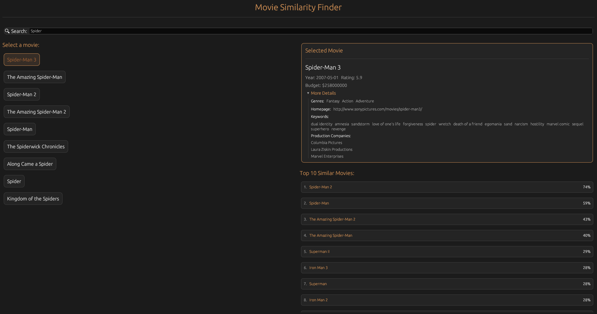

# CBR-movie
A Rust application that helps you discover movies similar to your favorites based on various attributes like genres, keywords, budget, and more

### Features

* **Intuitive UI**: Clean, modern dark-themed interface built with egui
Smart Similarity Algorithm: Finds similar movies using multiple criteria:
  * Genre similarity
  * Keyword similarity
  * Production companies
  * Budget comparison
  * Title proximity
  * Homepage proximity

**Fast Search**: Quickly find movies with the built-in search functionality
Detailed Information: View comprehensive details about each movie
Percentage Matching: See exactly how similar each recommendation is

###  How It Works
The application uses a case-based reasoning approach to find similar movies. When you select a movie, the app calculates similarity scores between your selection and all other movies in the database using:

* Levenshtein distance for string comparisons
* Jaccard index for set-based attributes (genres, keywords, etc.)
* Normalized numerical comparisons for budget and other metrics

The top 10 most similar movies are then displayed with their similarity percentage.